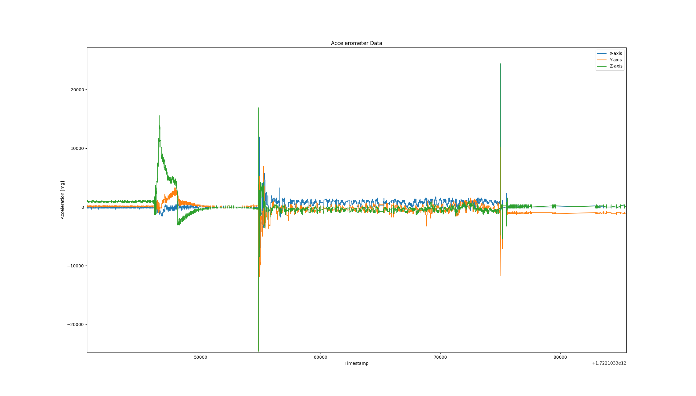

<h1 align="center">Welcome to Rocket-model-with-live-acceleration-view 👋</h1>

  

---

# Rocket Model with ESP32 Communication

This project involves designing and simulating a rocket model using OpenRocket and FreeCAD, combined with real-time acceleration through ESP32-based communication. The main goal was to achieve live communication between the rocket and the ground using ESPNow protocol, allowing for low-latency, peer-to-peer data exchange during the flight. Additionally, a buzzer system was implemented to recover rocket after landing.

## Features
- **Rocket Design**: Base for rocket model was designed in [OpenRocket](https://openrocket.info/) which also enables flight simulations. For further processing [FreeCAD](https://www.freecad.org/) was helpful. All parts are available in [model directory](model/stl_files/)
- **Motors**: Rocket motors used: [A6-4, B4-4](https://www.scorpio-polska.pl/katalog/klima/klima-silnik-rakietowy-a6-4-b4-4-c6-7-2-2-2-p68365.html) and [PS-16-A](https://www.modelmania.eu/silnik-do-rakiety-ps-16-a-1szt-125935)
- **Embedded programming**: Utilized ESP32 development boards for their built-in Wi-Fi capabilities, enabling real-time communication between the rocket and ground station using the ESPNow protocol. Two ESP32 boards were used: Seeed Studio XIAO ESP32C3 (transmitter) and [ESP32-Pico](https://shop.m5stack.com/products/m5stickc-plus-esp32-pico-mini-iot-development-kit) (receiver) which was build in M5StickC plus, both programmed using [PlatformIO](https://platformio.org/).
- **Flight Recovery**: Integrated a parachute and buzzer system, programmed using interrupts, to assist in locating the rocket post-flight.
- **Data processing**: Python helps with live data projection and collecting it to csv file.  

## Technologies Used
- **OpenRocket**: For simulating the rocket's flight dynamics.
- **FreeCAD**: For 3D modeling and design.
- **ESP32 with ESPNow**: For wireless communication between the rocket and ground control.
- **Python**: For collecting data from serial port and data poltting.

## Resources
Here are some helpful resources I used throughout this project:
- [ESP32 Wireless Communication Protocols](https://randomnerdtutorials.com/esp32-wireless-communication-protocols/)
- [Gravity I2C Triple Axis Accelerometer - LIS2DH](https://wiki.dfrobot.com/Gravity__I2C_Triple_Axis_Accelerometer_-_LIS2DH_SKU_SEN0224)
- [ESPNow Unicast Example](https://github.com/yoursunny/WifiEspNow/blob/main/examples/EspNowUnicast/EspNowUnicast.ino)
- [Seeed Studio XIAO ESP32C3 Getting Started Guide](https://wiki.seeedstudio.com/XIAO_ESP32C3_Getting_Started/)

---

### 🏠 [Homepage](Demo)

<video src="flight_data/flight_slow_motion.mp4" width="320" height="200" controls preload></video>
<video src="flight_data/flight.mp4" width="320" height="200" controls preload></video>

## Author

👤 **Piotr Koronczok**

* Github: [@triplo098](https://github.com/triplo098)
* LinkedIn: [@Piotr Koronczok](https://www.linkedin.com/in/piotr-koronczok-b52b012a9/)

***
_This README was generated with ❤️ by [readme-md-generator](https://github.com/kefranabg/readme-md-generator)_